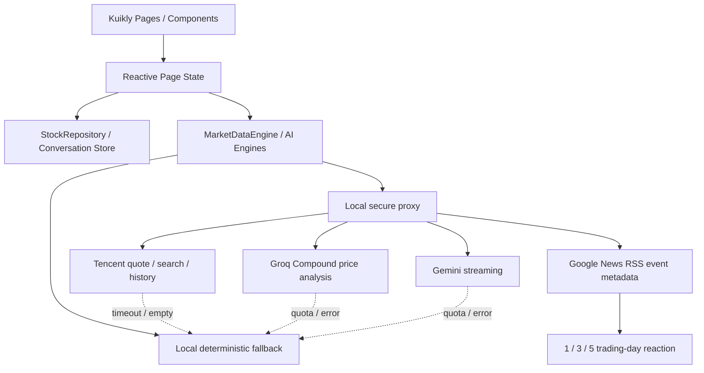

# 知势 — AI 股票投研助手

知势是一个基于 Tencent Kuikly 的跨端 AI 股票投研助手，同一工程内完整实现两个比赛任务：

- **Task 1：AI 股票行情原型** — A股/港股名称、代码及拼音搜索，自选行情、真实行情刷新、20 日收盘折线、个股详情、Gemini 结构化解读、离线兜底。
- **Task 2：AI 股票问答** — 多轮对话、本地历史恢复、流式输出、Markdown 渲染、单股洞察、双股量化对比与风险排行卡片、详情页承接。

## OpenSourceTalent 任务汇总

本次完成 **Task 1、Task 2 和 Task 3**。

| Task | 项目 | 代码仓库 |
| --- | --- | --- |
| Task 1 & 2 | 知势 — AI 股票投研助手 | 当前仓库 |
| Task 3 | DSH App · AI Conversation Experience Enhancement | https://github.com/HelenZhutt/deepseek-harness-mobile |

> **Task 3 使用独立仓库实现。** 该项目基于 Kuikly 开发 DSH 移动端，完成了流式消息、工具交互、图片附件、Markdown / LaTeX 渲染、复制与导出、会话管理、主题、插件、日志以及异常重连等功能。完整代码、运行说明及实现细节请查看上方 Task 3 仓库。
> 
> 🎥 **Task 1、Task 2 和 Task 3 的演示视频均已通过邮件发送至 `elixxli@tencent.com`，供评审查看。**

## 亮点
1. **完整业务闭环**：行情列表 → 个股详情 → AI 解读 → 继续追问；聊天中的股票卡片也可反向进入详情。
2. **真实 AI 接入**：Groq Compound（或可切换的 Gemini/OpenAI）密钥只保存在本机代理进程，不写入 App 或仓库；代理强制返回结构化 JSON，页面展示稳定可控。
3. **可靠演示**：网络、额度或 API 异常时自动切换本地知识库，界面会明确显示“离线兜底”，不会无限加载或伪装在线结果。
4. **可验证的行情图表**：代理同时获取当前报价与 20 个交易日复权收盘价，跨端 Canvas 按真实数据绘制折线。
5. **双股量化比较**：涨跌幅、日内振幅、价格位置与风险等级并排呈现，不用绝对成交量误判强弱。
6. **可解释输出**：回答与卡片明确显示数据来源、行情时间、依据字段和教学免责声明。
7. **工程化分层**：页面、组件、数据模型、行情仓库、AI 服务和本机代理分离；`StockChatPage` 已拆出 MarkdownRenderer、ChatBubble 与 StockInsightCard。
8. **连续对话体验**：会话保存在设备本地；新对话不会删除旧记录，历史侧栏按最近打开时间排序，并支持删除单条会话。
9. **明确错误恢复**：行情刷新失败可再次点击刷新；详情和问答在线调用失败会显示橙色重试入口，并保留可用的本地结果。
10. **跨端一致**：Android 与 iOS 共用 Kotlin 业务/UI；代理地址自动适配 Android Emulator 的 `10.0.2.2` 与 iOS Simulator 的 `localhost`。
11. **动态股票发现**：搜索结果按市场区分，选中后获取真实报价与历史走势、加入本地自选并直接进入详情；重启 App 后恢复动态自选。
12. **AI 与图表联动**：详情页可切换 5 日/20 日窗口；横轴分别显示 3/4 个稀疏日期刻度，支撑位和压力位的数值直接标在线上，并展示置信度进度。
13. **可解释关键价位**：支撑/压力由最近 20 日收盘序列的局部低点/高点确定（无有效局部极值时退回窗口极值），作为结构化上下文交给 AI，而不是把当日 high/low 包装成模型判断。
14. **对话按需取数**：AI 对话识别明确的 A/H 股名称或代码；本地尚无该股票时临时查询真实报价与 20 日历史，再生成个股或比较卡片。临时查询不会自动加入自选，收藏仍由用户主动决定。
15. **无套娃导航**：对话中的任意股票卡片都可进入对应详情；从详情返回时回到原 AI 对话，不为每只股票继续叠加新的聊天页。
16. **首页行情密度**：每只自选股使用真实历史收盘绘制 mini sparkline，在进入详情前即可快速识别方向。
17. **数据驱动的 AI 市场雷达**：根据当前自选的涨跌、领涨/回调股票和平均振幅生成一句可验证的市场洞察，并以“查看今日解读”进入完整分析。
18. **Generative UI 输出**：单股问题、对比问题和风险排行分别呈现不同结构化组件，风险排行还可逐项进入对应详情。
19. **金融语义配色**：红涨绿跌仅用于行情；AI 判断改用“偏强/偏弱/关注”的蓝色语义，风险单独使用青绿/橙/红等级色。

## 目录说明

```text
shared/src/commonMain/kotlin/com/example/stockaidemo/
├── pages/StockListPage.kt      # Task 1 行情入口
├── pages/StockDetailPage.kt    # 个股详情与 AI 解读
├── pages/StockChatPage.kt      # Task 2 多轮问答
├── components/MarkdownRenderer.kt
├── components/ChatBubble.kt
├── components/StockInsightCard.kt # 单股/双股卡片与真实折线
├── data/AIAnalysisEngine.kt    # Task 1 AI 服务与降级
├── data/AIChatEngine.kt        # Task 2 AI 服务与降级
├── data/MarketDataEngine.kt    # 真实行情刷新与解析
├── data/StockRepository.kt     # 行情仓库与演示快照
└── model/                      # 页面与服务共享模型

openai_proxy.mjs                # Gemini/Groq/OpenAI 安全代理
start_gemini_proxy.sh           # Gemini 启动脚本
start_groq_proxy.sh             # Groq Compound 启动脚本
start_openai_proxy.sh           # OpenAI 启动脚本
```

架构主链路（UI、状态、数据、仓库和外部 API 分层）：



## Android 演示

### 1. 启动 AI 代理

在项目根目录执行：

```bash
./start_groq_proxy.sh
```

按提示粘贴 Groq API Key。输入不会显示，也不会写入项目。看到以下内容即表示代理已启动：

```text
AI proxy listening on http://localhost:8787
Provider: groq
Model: groq/compound
```

修改过 `openai_proxy.mjs` 后重新运行脚本即可。脚本会识别并停止同一项目中占用 8787 端口的旧代理；如果端口属于其他程序，会明确提示而不会误关其他进程。

代理还提供 `/quotes`、`/chat-stream/start` 和 `/chat-stream/poll`：`/quotes` 同时返回当前报价和 20 日复权收盘历史；行情和模型密钥都不会直接暴露在客户端。近期事件仅从 Google News RSS 取得可核验的标题、日期、来源和链接，再用本地行情计算发布后 1/3/5 个交易日的价格变化；不抓全文，也不让模型编写新闻摘要。

### 2. 启动模拟器并运行

1. Android Studio 顶部设备栏选择 `Small Phone`。
2. 运行配置选择 `androidApp`。
3. 点击绿色运行按钮。
4. 首屏点击右上角“AI 问答”进入 Task 2。

### 中文输入

Android 模拟器不能直接使用 macOS 的中文输入法组合文字，需要使用模拟器内的 Gboard。当前 `Small Phone` 已配置“简体中文 → 拼音”，聚焦输入框后点击键盘浮动栏底部的 `US/拼` 即可切换。新建模拟器时可按以下路径添加：

`Settings → System → Keyboard → On-screen keyboard → Gboard → Languages → Add keyboard → 简体中文 → 拼音`

同时在 `Physical keyboard` 中开启 `Show on-screen keyboard`，即可一边使用 Mac 实体键盘输入拼音，一边在模拟器中选择中文候选词。

### 问答显示规则

- 明确询问某一只股票的行情、走势或风险：显示 AI 文本和结构化股票卡片。
- 对比问题显示双股卡片；“风险最高/风险排行”显示按真实振幅排序的风险榜单。
- “为什么”“解释一下”等一般追问：只补充新的分析依据，不重复绘制同一张卡片。
- 问候、能力询问和非股票问题：不强行关联列表第一只股票。
- 网络不可用时仍按上述规则降级，不会让所有问题都返回平安银行。
- Groq/Gemini 直接回答最新问题，简单问题简短作答、复杂问题再使用结构化段落，不固定套用同一分析模板。

### Demo 验证脚本

1. 不把“美图公司”加入自选，直接问“分析美图公司”，展示按需搜索、真实行情与 20 日历史；回答后首页自选不会被偷偷修改。
2. 输入“对比美团和小鹏”。若“小鹏”命中多只股票，先在候选项中确认目标，再继续原比较问题。
3. 先打开一条较早的历史会话，再展开侧栏；该会话应移动到最上方，证明排序依据是最近访问时间。
4. 个股研判只展示 20 日趋势、区间位置、最大回撤、波动率、量价信号与条件式观察，不逐日复述 20 个收盘价。
5. 事件影响最多展示 2 条不同类型的事件，只显示标题、日期、来源及发布后 1/3/5 个交易日的价格变化，并明确同期变化不代表因果。

### 失败与空状态

- 行情 API 超时或失败：保留最近可用快照，显示失败原因和“重试行情”，页面不会卡在加载中。
- AI API 超时、限流或失败：展示包含趋势、关键价位、回撤和条件触发的本地研判，并提供在线重试入口。
- 股票搜索无结果：明确显示“未找到匹配股票”，允许修改关键词；空输入不会残留上一次结果。
- 事件检索无结果：继续提供量化分析，不显示事件影响模块；历史行情不足时仍显示标题、日期和来源，但明确标注暂不判断市场反应。
- 模型意外返回内部字段：渲染前过滤 `insightTitle`、`insightSummary` 等 schema 名称及逐日原始价格行。

聊天历史使用 Kuikly 跨端 `SharedPreferencesModule` 保存在当前设备，因此原型阶段不需要数据库。若后续需要账号登录、多设备同步或服务端审计，再将同一消息模型接入后端数据库即可。

从个股详情进入问答时，原股票卡片显示“返回原详情”并复用已有页面；问答中识别到的其他股票卡片会打开对应详情。该详情页会识别自己来自聊天，把底部入口改为“返回 AI 对话”并关闭自身，而不会再创建第二层聊天，实现 `详情 A → AI 问答 → 详情 B → 返回问答` 的自然闭环。

也可用命令构建：

```bash
./gradlew clean :androidApp:assembleDebug
```

运行共享业务自动化测试：

```bash
./gradlew :shared:testDebugUnitTest
```

模拟器通过 `http://10.0.2.2:8787` 访问 Mac 上的本机代理。首页自动刷新成功后会显示数据源和更新时间，“查看今日解读”进入 AI 市场总结；失败则保留演示快照并提供“重试行情”。

## iOS 演示

首次运行先安装 CocoaPods 依赖：

```bash
cd iosApp
pod install
```

随后必须打开 `iosApp/iosApp.xcworkspace`，选择一个 iPhone Simulator 并运行 `iosApp` scheme。iOS 启动容器已经指向 `StockList`，并允许访问 Mac 上 `localhost:8787` 的本机代理。

如果命令行当前只指向 Command Line Tools，可这样构建：

```bash
DEVELOPER_DIR=/Applications/Xcode.app/Contents/Developer \
xcodebuild -workspace iosApp/iosApp.xcworkspace \
  -scheme iosApp -configuration Debug \
  -destination 'platform=iOS Simulator,name=iPhone 16 Pro' build
```

本次已在 iPhone 16 Pro / iOS 18.5 Simulator 完成构建与模拟器验证；演示视频待最终版本确认后录制。

iOS 容器只忽略设备边框安全区、不忽略键盘安全区。键盘弹出时 Kuikly 根视图会随可用高度缩小，因此问答输入栏会保持在键盘上方；无需页面手写一个固定键盘高度。

## HarmonyOS 演示

鸿蒙工程位于 `ohosApp`，首屏同样启动共享 Kuikly 页面 `StockList`。鸿蒙使用独立的 `settings.ohos.gradle.kts` 和 `shared/build.ohos.gradle.kts`，不会替换 Android/iOS 的构建配置。

1. 在 DevEco Studio 中打开 `ohosApp`，等待 ohpm/Hvigor 同步完成。
2. 在 `Project Structure > Signing Configs` 配置自动签名。
3. 启动 HarmonyOS 模拟器或连接设备，运行 `entry`。

也可在项目根目录构建并运行：

```bash
./ohosApp/runOhosApp.sh        # 构建；有设备和签名时自动安装运行
./ohosApp/runOhosApp.sh build  # 只构建 HAP
```

脚本默认识别 `/Applications/DevEco-Studio.app`；若安装在其他位置，可通过 `DEVECO_STUDIO_HOME` 指向应用内的 `Contents` 目录。未配置签名时仍会生成 `ohosApp/entry/build/default/outputs/default/entry-default-unsigned.hap`，但不能直接安装到设备。

